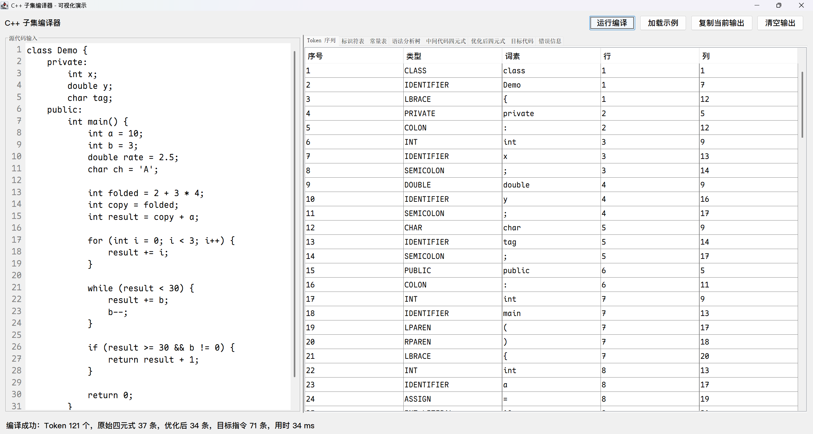
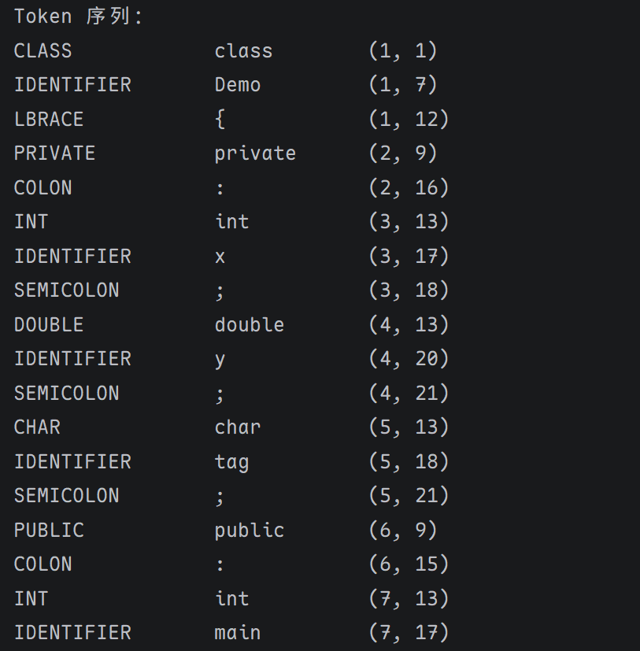

# C++ 子集编译器

一个教学导向的 C++ 子集编译器，使用 Java 21 编写。项目从源代码开始，依次经过词法分析、LL(1) 语法分析、语义分析、三地址码中间代码生成、基础优化和伪汇编目标代码生成，完整演示了一条可观察、可运行的编译流水线。

## 截图





## 特性

- 完整编译流水线：词法、语法、语义、中间代码、优化、目标代码生成。
- 词法分析：识别关键字、标识符、数字/字符/字符串常量、注释、运算符和分隔符，并记录标识符与常量表。
- LL(1) 语法分析：使用集中定义的文法、FIRST/FOLLOW 集、预测分析表和栈驱动分析器构建语法分析树。
- 语义分析与 IR：管理作用域和符号表，执行基础类型检查，并生成 `(op, arg1, arg2, result)` 形式的三地址码四元式。
- 中间代码优化：按基本块执行常量折叠、常量传播、复制传播、公共子表达式消除、死代码删除和跳转清理。
- 伪汇编生成：使用固定工作寄存器 `R1`，将四元式翻译为 `LOAD`、`STORE`、算术/关系/逻辑指令、`LABEL`、跳转和 `RET` 等教学型目标指令。
- Swing 可视化：提供源码编辑区和多标签输出，可查看 Token 序列、符号表、语法树、原始/优化四元式、目标代码和错误信息。
- 设计文档：每个编译阶段都有独立设计文档，便于阅读和扩展。

## 编译流水线


命令行入口 `org.yyds.Main` 和 Swing 入口 `org.yyds.gui.CompilerGui` 都复用这一流水线。

## 支持的语言子集

- 基本类型：`int`、`char`、`float`、`double`、`bool`、`void`。
- 程序结构：顶层变量声明、函数定义、`class` 定义及 `public`/`private`/`protected` 成员区段。
- 函数定义：支持参数列表、函数体和 `return`。
- 变量声明：支持可选初始化表达式。
- 赋值语句：支持普通赋值、`+=`、`-=`、`*=`、`/=`、`%=`，以及语句形式的 `++`、`--`。
- 控制流：`if`/`else`、`while`、`for`，其中 `for` 的初始化、条件和步进均可选。
- 表达式：支持算术运算、关系运算、逻辑运算、一元正负号和逻辑非。
- 字面量：整数、浮点数（含科学计数法）、字符、字符串、布尔值。
- 注释：支持 `//` 行注释和 `/* ... */` 块注释。

## 示例程序

```cpp
class Demo {
    private:
        int count;
    public:
        int main() {
            int result = 2 + 3 * 4;
            for (int i = 0; i < 3; i++) {
                result += i;
            }
            while (result < 30) {
                result += 2;
            }
            return result;
        }
};
```

运行 `org.yyds.Main` 时会使用内置示例程序，并依次输出 Token 序列、标识符表、常量表、语法分析树、原始四元式、优化后四元式和目标代码。

## 快速开始

### 环境要求

- JDK 21
- Maven（可选；没有 Maven 时也可以直接使用 `javac`）

### 使用 Maven

```bash
mvn compile
java -cp target/classes org.yyds.Main
```

### 不使用 Maven

```bash
javac -d target/classes $(find src/main/java -name '*.java')
java -cp target/classes org.yyds.Main
```

Windows PowerShell 可改为：

```powershell
javac -d target/classes (Get-ChildItem src/main/java -Recurse -Filter *.java).FullName
java -cp target/classes org.yyds.Main
```

### 运行 Swing 可视化界面

```bash
java -cp target/classes org.yyds.gui.CompilerGui
```

也可以使用 IntelliJ IDEA 以 Maven 项目方式打开，然后直接运行 `org.yyds.Main` 或 `org.yyds.gui.CompilerGui`。

## 项目结构

```text
src/main/java/org/yyds/
|-- lexer/       # 词法分析器、Token 和词法符号表
|-- parser/      # 文法、FIRST/FOLLOW、预测分析表、语法分析树
|-- semantic/    # 作用域、语义符号、类型检查
|-- ir/          # 三地址码四元式
|-- optimizer/   # 基本块划分与基础优化
|-- codegen/     # 伪汇编目标代码生成
|-- gui/         # Swing 可视化界面

docs/            # 各编译阶段设计文档
```

## 设计文档

| 编译阶段 | 设计文档 |
| --- | --- |
| 词法分析 | [docs/lexer-design.md](docs/lexer-design.md) |
| 语法分析 | [docs/parser-design.md](docs/parser-design.md) |
| 语义分析与 IR | [docs/semantic-ir-design.md](docs/semantic-ir-design.md) |
| 中间代码优化 | [docs/optimizer-design.md](docs/optimizer-design.md) |
| 目标代码生成 | [docs/codegen-design.md](docs/codegen-design.md) |

## 当前限制

- 这是教学导向的 C++ 子集编译器，不是完整 C++ 实现。
- 表达式暂不支持函数调用、成员访问、数组访问。
- `&&` 和 `||` 按普通逻辑运算生成 IR，不具备 C++ 的短路求值语义。
- 类当前覆盖类名、访问区段和成员登记，不支持对象实例化、成员访问或方法调用。
- 目标代码是教学用伪汇编，固定使用 `R1` 工作寄存器，不生成真实可执行程序。
- 命令行入口目前使用内置示例源码，不读取外部源文件；GUI 中可直接编辑源码。

## 可能的扩展方向

- 支持函数调用、实参与形参匹配检查。
- 支持对象模型、成员访问和数组访问。
- 为 `&&`、`||` 加入短路求值。
- 支持命令行读取外部源文件。
- 引入更完整的寄存器分配或真实平台目标代码。
