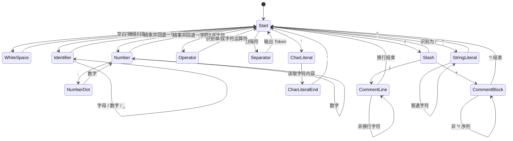

# C++ 编译器第一步：词法分析器设计

## 1. 词法分析器的作用

词法分析器（Lexer / Scanner）的任务，是把源代码中连续的字符流切分成有意义的最小单元，也就是**记号**（Token）。它处于编译流程的第一阶段，通常位于语法分析器之前。

以一行 C++ 代码为例：

```cpp
int a = 10 + b;
```

词法分析器会把它拆分为：

- `int` → 关键字
- `a` → 标识符
- `=` → 运算符
- `10` → 数字常量
- `+` → 运算符
- `b` → 标识符
- `;` → 分隔符

词法分析器的输出不是“字符”，而是“Token 序列”。后续语法分析器只关心这些 Token 的结构，不再直接处理原始字符。

---

## 2. 词法分析器的工作原理

词法分析器通常采用**顺序扫描**的方式从左到右读取源代码，并不断执行以下动作：

1. **跳过空白字符**：空格、制表符、换行等通常不参与语义构造。
2. **识别单词边界**：根据当前字符判断接下来是标识符、数字、运算符、分隔符，还是注释、字符串、字符常量。
3. **构造 Token**：把识别出的片段包装成统一的数据结构。
4. **记录位置信息**：保存行号、列号，方便后续报错定位。
5. **持续扫描直到结束**：输出完整 Token 流，并在结尾添加结束符 `EOF`。

这种设计的核心思想是：**只做“切分”和“分类”，不做语法判断**。例如，`a + b * c` 只会被识别为一串 Token，至于运算优先级如何处理，留给语法分析器完成。

---

## 3. C++ 词法单元的基本分类

为了实现一个简单的 C++ 编译器，词法分析器至少需要识别以下几类 Token：

### 3.1 关键字

C++ 中保留字不能作为普通标识符使用，例如：

- `int`
- `char`
- `if`
- `else`
- `while`
- `for`
- `return`
- `class`
- `public`
- `private`

### 3.2 标识符

标识符用于命名变量、函数、类、对象等，通常满足如下规则：

- 首字符为字母或下划线 `_`
- 后续字符可为字母、数字或下划线

例如：`sum`、`_temp1`、`maxValue`

### 3.3 常量

常量可分为多种类型：

- 整数常量：`0`、`123`
- 浮点常量：`3.14`、`2.0e-3`
- 字符常量：`'a'`、`'\n'`
- 字符串常量：`"hello"`

### 3.4 运算符

包括单字符和多字符运算符，例如：

- 单字符：`+`、`-`、`*`、`/`、`=`、`<`、`>`
- 多字符：`==`、`!=`、`<=`、`>=`、`&&`、`||`、`++`、`--`、`+=`

### 3.5 分隔符

常见分隔符包括：

- `(` `)`
- `{` `}`
- `[` `]`
- `,` `;` `:`

### 3.6 注释

C++ 常见注释形式：

- 单行注释：`// ...`
- 多行注释：`/* ... */`

注释会被词法分析器跳过，不生成有效 Token。

---

## 4. 基本符号表设计

在词法分析阶段，“符号表”并不一定等同于后续语义分析中的完整符号表。这里可以把它理解为一种**预分类与登记机制**，用于辅助识别和记录词法元素。

### 4.1 设计目标

基本符号表主要承担三类任务：

1. **快速判定保留字与普通标识符**
2. **记录已出现的标识符和常量**
3. **保存 Token 的类别信息，便于后续阶段查询**

### 4.2 建议的数据结构

可以设计为以下几张表：

#### 4.2.1 关键字表

使用 `Set<String>` 保存所有关键字，例如：

```java
Set<String> keywords = Set.of(
    "int", "char", "if", "else", "while", "for", "return", "class"
);
```

作用：快速判断某个字符串是否为关键字。

#### 4.2.2 运算符表

使用 `Map<String, TokenType>` 保存运算符到 Token 类型的映射，例如：

```java
Map<String, TokenType> operators = Map.of(
    "+", TokenType.PLUS,
    "-", TokenType.MINUS,
    "==", TokenType.EQ,
    "!=", TokenType.NEQ
);
```

作用：支持单字符与多字符运算符的优先匹配。

#### 4.2.3 标识符表

使用 `Map<String, Integer>` 或 `Map<String, Symbol>` 记录标识符。

例如：

- 标识符名称
- 出现次数
- 首次出现位置
- 类型信息（可在后续语义分析中补充）

#### 4.2.4 常量表

保存数字常量、字符串常量、字符常量等。

例如：

- 常量文本
- 常量类型
- 值（可选）
- 位置

### 4.3 基本符号表示例

可以抽象为如下结构：

```java
public class Symbol {
    private final String lexeme;
    private final TokenType type;
    private final int line;
    private final int column;

    public Symbol(String lexeme, TokenType type, int line, int column) {
        this.lexeme = lexeme;
        this.type = type;
        this.line = line;
        this.column = column;
    }

    public String getLexeme() { return lexeme; }
    public TokenType getType() { return type; }
    public int getLine() { return line; }
    public int getColumn() { return column; }
}
```

这个结构可以作为后续词法表、语义表、错误定位的基础。

---

## 5. 简单状态转换图

词法分析器本质上可以看作一个有限状态机。下面给出一个适合本项目的简化状态图。



这个状态图体现了词法分析器最核心的思路：

- 从 `Start` 状态出发
- 按字符类别切换到不同分支
- 直到识别出一个完整 Token，再回到 `Start`

---

## 6. 词法分析算法设计

本项目的词法分析算法可以采用“**单字符推进 + 前瞻判断**”的方式实现。

### 6.1 总体流程

1. 初始化源代码缓冲区、当前索引、行号和列号。
2. 从头到尾遍历字符流。
3. 对每个字符进行分类：
   - 空白：跳过
   - 字母或 `_`：识别标识符或关键字
   - 数字：识别整数或浮点数
   - `"` 或 `'`：识别字符串或字符常量
   - `/`：判断是否为注释
   - 运算符或分隔符：生成对应 Token
4. 无法识别时输出词法错误。
5. 结束后追加 `EOF` Token。

### 6.2 识别规则

#### 标识符 / 关键字

当首字符是字母或 `_` 时，持续读取后续的字母、数字、`_`，直到遇到不合法字符为止。

然后检查该字符串是否在关键字表中：

- 如果是关键字 → 生成关键字 Token
- 如果不是 → 生成标识符 Token，并写入标识符表

#### 数字常量

当首字符是数字时，继续读取数字。如果后续遇到 `.`，则可能进入浮点数识别。

例如：

- `123` → 整数
- `3.14` → 浮点数
- `2e10` → 科学计数法（可在后续扩展）

#### 字符串 / 字符常量

- 字符串以 `"` 开始，以 `"` 结束，中间允许转义字符
- 字符常量以 `'` 开始，以 `'` 结束，通常只包含一个字符或转义序列

#### 注释

- `//` 后面直到行尾都跳过
- `/* ... */` 直到遇到结束符 `*/` 才停止

#### 运算符与分隔符

运算符建议采用“**最长匹配原则**”：

- 优先判断 `==`、`!=`、`<=`、`>=`、`&&`、`||` 这类双字符运算符
- 若不成立，再识别单字符运算符，如 `+`、`-`、`*`、`/`

---

## 7. Java 代码实现思路

下面给出一个适合本项目的简化实现方案。这个实现重点是结构清晰、便于后续扩展。

### 7.1 Token 类型定义

```java
public enum TokenType {
    // 关键字
    INT, CHAR, IF, ELSE, WHILE, FOR, RETURN, CLASS,

    // 标识符与常量
    IDENTIFIER, INT_LITERAL, FLOAT_LITERAL, CHAR_LITERAL, STRING_LITERAL,

    // 运算符
    PLUS, MINUS, STAR, SLASH, ASSIGN,
    EQ, NEQ, LT, GT, LE, GE,
    AND, OR, INC, DEC,

    // 分隔符
    LPAREN, RPAREN, LBRACE, RBRACE, LBRACKET, RBRACKET,
    COMMA, SEMICOLON, COLON,

    EOF, UNKNOWN
}
```

### 7.2 Token 数据结构

```java
public class Token {
    private final TokenType type;
    private final String lexeme;
    private final int line;
    private final int column;

    public Token(TokenType type, String lexeme, int line, int column) {
        this.type = type;
        this.lexeme = lexeme;
        this.line = line;
        this.column = column;
    }

    public TokenType getType() { return type; }
    public String getLexeme() { return lexeme; }
    public int getLine() { return line; }
    public int getColumn() { return column; }
}
```

### 7.3 词法分析器核心框架

```java
public class Lexer {
    private final String source;
    private int index = 0;
    private int line = 1;
    private int column = 1;

    public Lexer(String source) {
        this.source = source;
    }

    public List<Token> tokenize() {
        List<Token> tokens = new ArrayList<>();
        while (!isAtEnd()) {
            char c = peek();

            if (Character.isWhitespace(c)) {
                skipWhitespace();
                continue;
            }

            int startLine = line;
            int startColumn = column;

            if (Character.isLetter(c) || c == '_') {
                tokens.add(readIdentifierOrKeyword(startLine, startColumn));
            } else if (Character.isDigit(c)) {
                tokens.add(readNumber(startLine, startColumn));
            } else {
                tokens.add(readSymbol(startLine, startColumn));
            }
        }

        tokens.add(new Token(TokenType.EOF, "", line, column));
        return tokens;
    }
}
```

### 7.4 标识符与关键字识别

```java
    private Token readIdentifierOrKeyword(int startLine, int startColumn) {
        StringBuilder sb = new StringBuilder();
        while (!isAtEnd()) {
            char c = peek();
            if (Character.isLetterOrDigit(c) || c == '_') {
                sb.append(advance());
            } else {
                break;
            }
        }

        String lexeme = sb.toString();
        return switch (lexeme) {
            case "int" -> new Token(TokenType.INT, lexeme, startLine, startColumn);
            case "char" -> new Token(TokenType.CHAR, lexeme, startLine, startColumn);
            case "if" -> new Token(TokenType.IF, lexeme, startLine, startColumn);
            case "else" -> new Token(TokenType.ELSE, lexeme, startLine, startColumn);
            case "while" -> new Token(TokenType.WHILE, lexeme, startLine, startColumn);
            case "for" -> new Token(TokenType.FOR, lexeme, startLine, startColumn);
            case "return" -> new Token(TokenType.RETURN, lexeme, startLine, startColumn);
            case "class" -> new Token(TokenType.CLASS, lexeme, startLine, startColumn);
            default -> new Token(TokenType.IDENTIFIER, lexeme, startLine, startColumn);
        };
    }
```

### 7.5 数字识别

```java
    private Token readNumber(int startLine, int startColumn) {
        StringBuilder sb = new StringBuilder();
        while (!isAtEnd() && Character.isDigit(peek())) {
            sb.append(advance());
        }

        boolean isFloat = false;
        if (!isAtEnd() && peek() == '.') {
            isFloat = true;
            sb.append(advance());
            while (!isAtEnd() && Character.isDigit(peek())) {
                sb.append(advance());
            }
        }

        return new Token(
            isFloat ? TokenType.FLOAT_LITERAL : TokenType.INT_LITERAL,
            sb.toString(),
            startLine,
            startColumn
        );
    }
```

### 7.6 符号与注释识别

```java
    private Token readSymbol(int startLine, int startColumn) {
        char c = advance();

        return switch (c) {
            case '+' -> {
                if (!isAtEnd() && peek() == '+') {
                    advance();
                    yield new Token(TokenType.INC, "++", startLine, startColumn);
                }
                yield new Token(TokenType.PLUS, "+", startLine, startColumn);
            }
            case '-' -> new Token(TokenType.MINUS, "-", startLine, startColumn);
            case '*' -> new Token(TokenType.STAR, "*", startLine, startColumn);
            case '=' -> {
                if (!isAtEnd() && peek() == '=') {
                    advance();
                    yield new Token(TokenType.EQ, "==", startLine, startColumn);
                }
                yield new Token(TokenType.ASSIGN, "=", startLine, startColumn);
            }
            case ';' -> new Token(TokenType.SEMICOLON, ";", startLine, startColumn);
            case '(' -> new Token(TokenType.LPAREN, "(", startLine, startColumn);
            case ')' -> new Token(TokenType.RPAREN, ")", startLine, startColumn);
            case '{' -> new Token(TokenType.LBRACE, "{", startLine, startColumn);
            case '}' -> new Token(TokenType.RBRACE, "}", startLine, startColumn);
            default -> new Token(TokenType.UNKNOWN, String.valueOf(c), startLine, startColumn);
        };
    }
```

### 7.7 辅助方法

```java
    private boolean isAtEnd() {
        return index >= source.length();
    }

    private char peek() {
        return source.charAt(index);
    }

    private char advance() {
        char c = source.charAt(index++);
        if (c == '\n') {
            line++;
            column = 1;
        } else {
            column++;
        }
        return c;
    }

    private void skipWhitespace() {
        while (!isAtEnd() && Character.isWhitespace(peek())) {
            advance();
        }
    }
```

---

## 8. 设计小结

本阶段词法分析器的目标不是一次性实现完整 C++ 语法，而是先建立一个稳定、可扩展的扫描框架。它应具备以下特征：

- 能正确识别关键字、标识符、常量、运算符和分隔符
- 能跳过空白和注释
- 能记录行列信息，便于错误定位
- 能输出统一的 Token 序列，供后续语法分析使用

后续可以继续扩展：

- 支持更多 C++ 运算符
- 支持十六进制、八进制、科学计数法
- 支持更完整的字符串转义规则
- 将符号表细化为语义分析可复用的数据结构

如果需要，这份文档可以直接作为项目的第一章设计说明，也可以进一步改写成 README 或课程论文格式。